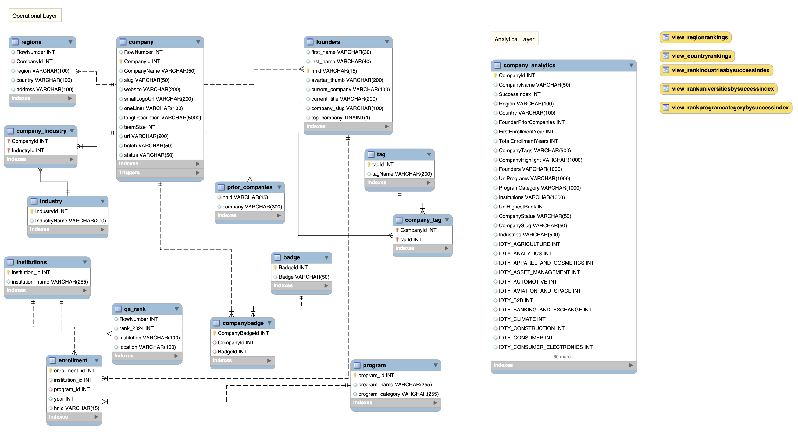

<a id="readme-top"></a>

[![Contributors][contributors-shield]][contributors-url]
[![Stargazers][stars-shield]][stars-url]
[![Issues][issues-shield]][issues-url]
[![LinkedIn][linkedin-shield]][linkedin-url]

<br />
<div align="center">
  <a href="https://github.com/yutongliang723/young_company_SQL/blob/main/README.md">
    
  </a>

  <h3 align="center">Young Companies SQL </h3>

  <p align="center">
    Find out the success factors for startups.
    <br />
    <a href="https://github.com/othneildrew/Best-README-Template"><strong>Explore the docs »</strong></a>
    <br />
    <br />
    <a href="https://github.com/othneildrew/Best-README-Template">View Demo</a>
    ·
    <a href="https://github.com/othneildrew/Best-README-Template/issues/new?labels=bug&template=bug-report---.md">Report Bug</a>
    ·
    <a href="https://github.com/othneildrew/Best-README-Template/issues/new?labels=enhancement&template=feature-request---.md">Request Feature</a>
  </p>
</div>


<!-- TABLE OF CONTENTS -->
<details>
  <summary>Table of Contents</summary>
  <ol>
    <li>
      <a href="#about-the-project">About The Project</a>
      <ul>
        <li><a href="#built-with">Built With</a></li>
      </ul>
    </li>
    <li>
      <a href="#getting-started">Getting Started</a>
      <ul>
        <li><a href="#prerequisites">Prerequisites</a></li>
        <li><a href="#installation">Installation</a></li>
      </ul>
    </li>
    <li><a href="#usage">Usage</a></li>
    <li><a href="#roadmap">Roadmap</a></li>
    <li><a href="#contributing">Contributing</a></li>
    <li><a href="#license">License</a></li>
    <li><a href="#contact">Contact</a></li>
    <li><a href="#acknowledgments">Acknowledgments</a></li>
  </ol>
</details>


<!-- ABOUT THE PROJECT -->
## About The Project


This project is designated to understand the profile of young companies, especially for those which are  "succcessful". For example, Airbnb, GitLab, Amplitude, etc.

Here is the general steps for the project:
* This project takes the data from Kaggle [2024 YCombinator All Companies Datase](https://www.kaggle.com/datasets/sashakorovkina/ycombinator-all-funded-companies-dataset?resource=download&select=badges.csv) and import the relevant tables into MYSQLWorkbench and performed normalization.
* For the university table, the original university names are mapped into the standard QS table using cosine similarity with BERT LLM model.
* ETL (Extract, Transform, Load) is performed for the operational layer data by creating success index for the companys and joining the relevant dimensions. The result is loaded into the analytical layer with a table representation.
* Several procedures are created for the purpose of analysing such as `RankUniversitiesBySuccessIndex` or `RankProgramCategoryBySuccessIndex`. In the end, several views are created as data marts based on the analytical procedures.

This project functions primarily as the bulding database and data preperation startpoint. Further analytics are expected to be done with other tools.

Use the `README.md` to get started.

<p align="right">(<a href="#readme-top">back to top</a>)</p>


### Built With


* [![MySQLWorkbench][mysql.url]][mysql-url]
* [![Python][Python.url]][Python-url]

<p align="right">(<a href="#readme-top">back to top</a>)</p>


<!-- GETTING STARTED -->
## Getting Started

### Prerequisites

To comply with the file reading process in MySQLWorkbench, one needs to run two scripts in MySQLWorkbench to set up the necessary environment.

```
SHOW VARIABLES LIKE "local_infile";
SHOW VARIABLES LIKE "secure_file_priv";
```
The first command results should `= ON` and the second command result should be the path which store the files to be read later.  

Suppose the path mentioned above is `/private/tmp/`, then run the following commands in the terminal. 

### Preperation

Download the folder named `young_company` first and locate to that folder before running the commands. 

The following commands is the bash example:

```
cp badges.csv companies.csv founders.csv industries.csv prior_companies.csv regions.csv schools.csv tags.csv /private/tmp/
```
This step allows the relevant files to be put in the correct place.

If “local_infile” is not `ON` or “secure_file_priv” is `NULL`, you need to change my.cnf (Mac,Linux) or my.ini (Windows) - _class material_. 


<!-- USAGE EXAMPLES -->
## Usage

Open the file `YC_production.sql` in MySQLWorkbench and run it, the table structure should be set up. The run time is expected to be 30 seconds.

### Data Structure Preview - ER Diagram
<div align="center">
  <a>
    
  </a>
</div>
  

At an end result, we have 14 relational tables, 1 analytical table, 5 views, and 15 store procedures.


<p align="right">(<a href="#readme-top">back to top</a>)</p>

<!-- DETAILS -->
## Details

### Data Structure
Looking into the details of the young company data structure, before normalizing, we have eight main tables: `company, founders, regions, industries, badges, tags, schools, prior_companies`. Company and founders is one to many relationship. The same works for company and industris. 'badges' and 'tags' describes the characteristics and value of the company such as "highlightWomen", "nonprofit", "topCompany", etc. For the sake of the data integrity, I normalized `schools` to `programs`, `institutions`, and `qs_rank`; `badges` to `badges` and `companybadge`; `tags` to `tag` and `company_tag`; `industries` to `industry` and `company_industry`

* `company`: RowNumber, CompanyId’, ‘CompanyName’, ‘slug’, ‘website’, ‘smallLogoUrl’, ‘oneLiner’, ‘longDescription’, ‘teamSize’, ‘url’, ‘batch’, ‘status’;
*  `founders`: ‘first_name’, ‘last_name’, ‘hnid’, ‘avartar_thumb’, ‘current_company’, ‘current_title’, ‘company_slug’, ‘top_company’;
* `regions`: ‘RowNumber’, ‘CompanyId’, ‘region’, ‘country’, ‘address’;
* `industry`: ‘IndustryId’, ‘IndustryName’;
* `badges`: ‘BadgeId’, ‘Badge’;
* `tag`: ‘tagId’, ‘tagName’;
* `program`:’program_id’, ‘program_name’, ‘program_category’;
* `prior_companies`: ‘hnid’, ‘company’
* `qs_rank`: ‘RowNumber’, ‘rank_2024’, ‘instituion’, ‘location’;
* `institutions`: ‘institution_id’, ‘institution_name’;
* `enrollment`:’enrollment_id’, ‘institution_id’, ‘program_id’, ‘year’, ‘hnid’;
* `company_tag`: ‘CompanyId’, ‘tagId’;
* `company_industry`:’CompanyId’, ‘IndustryId’;
* `companybadge`: ‘CompanyBadgeId’, ‘CompanyId’, ‘BadgeId’

### Mapping Procedure

In the raw dataset, `schools` table's 'school' column which records the university's names young companies founders attended, do not have the standard name. Therefore, there was no quantitative data available for the university. To map the universities to the standard QS Ranking names and map them with ranking score, cosine similarity is used to map the universities to their standard names with Sentence-BERT model. Given the high variation of some input university names, the final mapping results is around 30%. The mapping was done with Python - `mapping_qs.ipynb`. The output query was copy-pasted to the SQL file. Example univeristy name mapping query:

```
UPDATE young_company.schools SET school = 'Trinity College Dublin, The University of Dublin' WHERE school = 'university of dublin, trinity college';

UPDATE young_company.schools SET school = 'College of William and Mary' WHERE school = 'William & Mary';
```

### Topic Modelling

During the ETL process of creating analytical layer, 'industry' column in the `industries` table which describes the industry of the young company and the 'field_of_study' column in the `schools` table are further transformed. 

Given that industry and company variables are many-to-many relationship, which is the same situation for the field of study variable, they are transposed from row values to column values - the company with that certain industry or of the founders have have been enrolled in that university program `= 1`, else, `= 0`. 

Industry can be directly manipulted by pivoting the unique row values. However, for field of study, the vast amount of distinct values (> 1000) requires the topic generation and topic modelling process.  
* Topic generation: 15 topics are generated after using TF-IDF dimensionality with TruncatedSVD in Python and GPT prompt engineering with chatGPT.  
  * TF-IDF dimensionality: reduce dimensionality to 50 groups of study topics and doing clustering with K-Means;
  * Prompt Engineering: using chatGPT -4o to further reduce the clusters into 15:
    ```
    Prompt: create 15 names of those 50 clusters, such as computer science, mathemetics, .... that will be further cosine similarity friendly.
    ```

## Result 

After ETL operation, one anlaytical layer is achieved with one dataware house table `company_analytics`in the same schema. The columns are:

'CompanyId'
'CompanyName'
'SuccessIndex'
'Region'
'Country'
'FounderPriorCompanies'
'FirstEnrollmentYear'
'TotalEnrollmentYears'
'CompanyTags'
'CompanyHighlight'
'Founders'
'UniPrograms'
'ProgramCategory'
'Institutions'
'UniHighestRank'
'CompanyStatus'
'CompanySlug'
'Industries'
'IDTY_AGRICULTURE'
'IDTY_ANALYTICS'
...
'IDTY_TRAVEL_LEISURE_AND_TOURISM'
'IDTY_VIRTUAL_AND_AUGMENTED_REALITY'
'UNI_ENGINEERING_'
...
'UNI_BANKING_AND_FINANCE_SPECIALIZATION'

Columns starts with IDTY_ are the industries; columns starts with UNI_ are the university programs.

### Procedures and Views for Analysis

The Stored Procedure relevant for analysis: 

- ETL_Company_Analysis: The main procedure for ETL process
- GetSuccessfulStartups: to get the unique successful startups to call the ranking calls more easily.
- GetUniqueCountries: to get the unique unique countries to call the ranking calls more easily.
- GetUniqueIndustries:to get the unique industries to call the ranking calls more easily.
- GetUniqueRegions: to get the unique regions to - call the ranking calls more easily.
- GetUniqueUniversities: to get the unique universities to call the ranking calls more easily.
- RankCountriesAndRegions: to get successful company counts/index by filtering to countries or regions. For example, `CALL RankCountriesAndRegions('Country', 'United States of America')` or `CALL RankCountriesAndRegions('Region', NULL)`
- RankIndustriesBySuccessIndex: to get the successful companys based on listing the industry. This allows user to analysis which industry tends to increase startups' chance to success.
- RankProgramCategoryBySuccessIndex: same use cases as `RankIndustriesBySuccessIndex`
- RankUniversitiesRankingBySuccessIndex:same use cases as `RankIndustriesBySuccessIndex`
- Update_Industry_Columns: this is to add "IDTY_" in front of industry relevant columns. By adding a prefix, it is easier to get the values of certain industries. 
- Update_Program_Columns: same use cases as `Update_Industry_Columns` but for the Program relevant columns by adding "UNI_" as a prefix.
- AlterColumnNames: part of the data normalization process when creating more tables for the data intergrity purposes.


<!-- CONTRIBUTING -->
## Contributing

Contributions are what make the open source community such an amazing place to learn, inspire, and create. Any contributions you make are **greatly appreciated**.

If you have a suggestion that would make this better, please fork the repo and create a pull request. You can also simply open an issue with the tag "enhancement".
Don't forget to give the project a star! Thanks again!

1. Fork the Project
2. Create your Feature Branch (`git checkout -b feature/AmazingFeature`)
3. Commit your Changes (`git commit -m 'Add some AmazingFeature'`)
4. Push to the Branch (`git push origin feature/AmazingFeature`)
5. Open a Pull Request

### Top contributors:

<a href="https://github.com/yutongliang723/young_company_SQL/graphs/contributors">
  
</a>

<p align="right">(<a href="#readme-top">back to top</a>)</p>


<!-- CONTACT -->
## Contact

Yutong Liang - liang_yutong@student.ceu.edu

Project Link: [https://github.com/yutongliang723/young_company_SQL](https://github.com/yutongliang723/young_company_SQL)

<p align="right">(<a href="#readme-top">back to top</a>)</p>


<!-- ACKNOWLEDGMENTS -->
## Acknowledgments

Use this space to list resources you find helpful and would like to give credit to. I've included a few of my favorites to kick things off!

* [Choose an Open Source License](https://choosealicense.com)
* [GitHub Emoji Cheat Sheet](https://www.webpagefx.com/tools/emoji-cheat-sheet)
* [Malven's Flexbox Cheatsheet](https://flexbox.malven.co/)
* [Malven's Grid Cheatsheet](https://grid.malven.co/)
* [Img Shields](https://shields.io)
* [GitHub Pages](https://pages.github.com)
* [Font Awesome](https://fontawesome.com)
* [React Icons](https://react-icons.github.io/react-icons/search)

<p align="right">(<a href="#readme-top">back to top</a>)</p>


<!-- MARKDOWN LINKS & IMAGES -->
<!-- https://www.markdownguide.org/basic-syntax/#reference-style-links -->
[contributors-shield]: https://img.shields.io/github/contributors/othneildrew/Best-README-Template.svg?style=for-the-badge
[contributors-url]: https://github.com/othneildrew/Best-README-Template/graphs/contributors
[forks-shield]: https://img.shields.io/github/forks/othneildrew/Best-README-Template.svg?style=for-the-badge
[forks-url]: https://github.com/othneildrew/Best-README-Template/network/members
[stars-shield]: https://img.shields.io/github/stars/othneildrew/Best-README-Template.svg?style=for-the-badge
[stars-url]: https://github.com/othneildrew/Best-README-Template/stargazers
[issues-shield]: https://img.shields.io/github/issues/othneildrew/Best-README-Template.svg?style=for-the-badge
[issues-url]: https://github.com/othneildrew/Best-README-Template/issues
[license-shield]: https://img.shields.io/github/license/othneildrew/Best-README-Template.svg?style=for-the-badge
[license-url]: https://github.com/othneildrew/Best-README-Template/blob/master/LICENSE.txt
[linkedin-shield]: https://img.shields.io/badge/-LinkedIn-black.svg?style=for-the-badge&logo=linkedin&colorB=555
[linkedin-url]: https://linkedin.com/in/othneildrew
[product-screenshot]: images/screenshot.png
[Next.js]: https://img.shields.io/badge/next.js-000000?style=for-the-badge&logo=nextdotjs&logoColor=white
[Next-url]: https://nextjs.org/
[React.js]: https://img.shields.io/badge/React-20232A?style=for-the-badge&logo=react&logoColor=61DAFB
[React-url]: https://reactjs.org/
[Vue.js]: https://img.shields.io/badge/Vue.js-35495E?style=for-the-badge&logo=vuedotjs&logoColor=4FC08D
[Vue-url]: https://vuejs.org/
[Angular.io]: https://img.shields.io/badge/Angular-DD0031?style=for-the-badge&logo=angular&logoColor=white
[Angular-url]: https://angular.io/
[Svelte.dev]: https://img.shields.io/badge/Svelte-4A4A55?style=for-the-badge&logo=svelte&logoColor=FF3E00
[Svelte-url]: https://svelte.dev/
[Laravel.com]: https://img.shields.io/badge/Laravel-FF2D20?style=for-the-badge&logo=laravel&logoColor=white
[Laravel-url]: https://laravel.com
[Bootstrap.com]: https://img.shields.io/badge/Bootstrap-563D7C?style=for-the-badge&logo=bootstrap&logoColor=white
[Bootstrap-url]: https://getbootstrap.com
[JQuery.com]: https://img.shields.io/badge/jQuery-0769AD?style=for-the-badge&logo=jquery&logoColor=white
[JQuery-url]: https://jquery.com 
[mysql.url]: https://img.shields.io/badge/mysql-4479A1.svg?style=for-the-badge&logo=mysql&logoColor=white
[mysql-url]: https://www.mysql.com/
[Python.url]:https://img.shields.io/badge/python-3670A0?style=for-the-badge&logo=python&logoColor=ffdd54
[Python-url]: https://www.python.org/