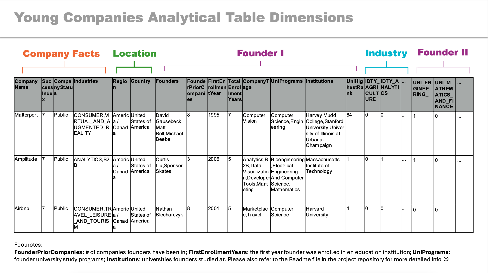

<a id="readme-top"></a>


<br />
<div align="center">
  <a href="https://github.com/yutongliang723/young_company_SQL/blob/main/README.md">
    
  </a>

  <h3 align="center">Young Companies SQL </h3>

</div>


<!-- TABLE OF CONTENTS -->
<!-- TABLE OF CONTENTS -->
<details>
  <summary>Table of Contents</summary>
  <ol>
    <li>
      <a href="#about-the-project">About The Project</a>
      <ul>
        <li><a href="#built-with">Built With</a></li>
      </ul>
    </li>
    <li>
      <a href="#getting-started">Getting Started</a>
      <ul>
        <li><a href="#preparation">Preparation</a></li>
        <li><a href="#prerequisites">Prerequisites</a></li>
      </ul>
    </li>
    <li>
      <a href="#usage">Usage</a>
      <ul>
        <li><a href="#data-structure-preview---er-diagram">Data Structure Preview - ER Diagram</a></li>
      </ul>
    </li>
    <li>
      <a href="#analytical-plan">Analytical Plan</a>
      <ul>
        <li><a href="#industry-and-region-based-analysis">Industry and Region-Based Analysis</a>
          <ul>
            <li><a href="#key-metrics">Key Metrics</a></li>
          </ul>
        </li>
        <li><a href="#educational-background-analysis">Educational Background Analysis</a>
          <ul>
            <li><a href="#key-metrics-1">Key Metrics</a></li>
          </ul>
        </li>
        <li><a href="#database-architecture">Database Architecture</a>
          <ul>
            <li><a href="#analytical-data-layer">Analytical Data Layer</a></li>
            <li><a href="#etl-extract-transform-load-processes">ETL (Extract, Transform, Load) Processes</a></li>
            <li><a href="#data-mart-structure">Data Mart Structure</a></li>
          </ul>
        </li>
      </ul>
    </li>
    <li>
      <a href="#details">Details</a>
      <ul>
        <li><a href="#data-structure">Data Structure</a></li>
        <li><a href="#normalization">Normalization</a></li>
        <li><a href="#key-tables">Key Tables</a></li>
        <li><a href="#mapping-process">Mapping Process</a></li>
        <li><a href="#topic-modelling">Topic Modelling</a></li>
        <li><a href="#etl-extract-transform-load">ETL (Extract, Transform, Load)</a></li>
        <ul>
          <li><a href="#stored-procedure-etl_company_analytics">Stored Procedure: ETL_Company_Analytics</a></li>
          <li><a href="#stored-procedure-update_industry_column-and-update_program_column">Stored Procedure: Update_Industry_Column and Update_Program_Column</a></li>
        </ul>
        <li><a href="#trigger">Trigger</a></li>
      </ul>
    </li>
    <li>
      <a href="#result">Result</a>
      <ul>
        <li><a href="#procedures-and-views-for-analysis">Procedures and Views for Analysis</a></li>
        <ul>
          <li><a href="#stored-procedures-for-data-manipulation-and-etl">Stored Procedures for Data Manipulation and ETL</a></li>
          <li><a href="#stored-procedures-for-analysis-reading-data-only">Stored Procedures for Analysis (reading data only)</a></li>
        </ul>
        <li><a href="#analytical-table-dimensions">Analytical Table Dimensions</a></li>
      </ul>
    </li>
    <li><a href="#contributing">Contributing</a></li>
    <li><a href="#contact">Contact</a></li>
    <li><a href="#acknowledgments">Acknowledgments</a></li>
  </ol>
</details>

<!-- ABOUT THE PROJECT -->
## About The Project

This project aims to build a comprehensive SQL database from an operational data layer to an analytical data layer, providing a foundation for potential analysis of young, successful companies like Airbnb, GitLab, and Amplitude. The project focuses on integrating various SQL concepts learned throughout the course to demonstrate how each component fits into a larger database architecture and analytics pipeline. Using data from Kaggle's [2024 YCombinator All Companies Datase](https://www.kaggle.com/datasets/sashakorovkina/ycombinator-all-funded-companies-dataset?resource=download&select=badges.csv), the project built an analytical layer tables with MySQL Workbench, ETL, stored procedures, triggers, and data marts.

The project involves:
* Data normalization and ETL processes to create a comprehensive analytical table.
* For the university table, the original university names are mapped into the standard QS table using cosine similarity with BERT LLM model.
* ETL (Extract, Transform, Load) is performed for the operational layer data by creating success indices for the companys and joining the relevant dimensions. The result is loaded into the analytical layer with in a table format.
* Creation of stored procedures for data ranking and analysis such as `RankUniversitiesBySuccessIndex` or `RankProgramCategoryBySuccessIndex`.
* Views and data marts that organize data based on specific analytical needs.

This project functions primarily as the bulding database and data preperation startpoint. Further analytics are expected to be done with other tools.

Use the `README.md` to get started.

<p align="right">(<a href="#readme-top">back to top</a>)</p>


### Built With


* [![MySQLWorkbench][mysql.url]][mysql-url]
* [![Python][Python.url]][Python-url]

<p align="right">(<a href="#readme-top">back to top</a>)</p>


## Project Folder Structure
  data_for_python/  # the data used for Python mapping part (not in production)  
  ├── .DS_Store  
  ├── 2024 QS World University Rankings 1.2 (For qs.com) copy.xlsx  
  ├── institutions_full.csv  
  ├── program_category_output.xlsx  
  ├── programs_founder.csv  
  ├── qs_rank_2024.csv  
  young_company/ # in production   
  ├── .DS_Store  
  ├── ER_Diagram.png  # as shown before  
  ├── README.md  
  ├── YC_production.sql  #the main sql file to run  
  ├── analytical_dimensions.png  # for the data structure dimensions  
  ├── mapping_qs.ipynb  # Python file used for mapping (reference only, not in production)  
  └── yc_image.png  

<!-- GETTING STARTED -->
## Getting Started

### Preperation

Download the folder named `young_company` or clone the whole repository first and locate to that folder before running the commands. 

### Prerequisites

To ensure MySQL Workbench can access files correctly, you’ll need to check and set specific environment variables.

1. Run the following commands in MySQL Workbench:
  ```
  SHOW VARIABLES LIKE "local_infile";
  SHOW VARIABLES LIKE "secure_file_priv";
  ```
The first command results should `= ON` and the second command result should be the path which store the files to be read later.  

2. Assuming the path mentioned above is `/private/tmp/`, then run the following commands in the terminal. The following commands is the bash example:

  ```
  cp badges.csv companies.csv founders.csv industries.csv prior_companies.csv regions.csv schools.csv tags.csv /private/tmp/
  ```

3. If “local_infile” is not `ON` or “secure_file_priv” is `NULL`, you need to change my.cnf (Mac,Linux) or my.ini (Windows) - _class material_. 

This step allows the relevant files to be put in the correct place.

<!-- USAGE EXAMPLES -->
## Usage
To set up the database structure and create necessary relationship, stored procedures, and view:

1. Open the file `YC_production.sql` in MySQLWorkbench
2. Run the script. The setup should complete in approximately 1 minute.


### Data Structure Preview - ER Diagram
<div align="center">
  <a>
    
  </a>
</div>
  

The final structure includes 14 relational tables, 1 analytical table, 5 views, and 15 stored procedures.


<p align="right">(<a href="#readme-top">back to top</a>)</p>


<!--Analytical Plan-->
## Analytical Plan

This section outlines how the resulting database will be used to explore the factors influencing the success of young companies.

### Industry and Region-Based Analysis

The `RankIndustriesBySuccessIndex` and `RankCountriesAndRegions` stored procedures allow for investigating how different industries and regions impact the likelihood of success among young companies:

* Identify which industries have the highest average success index, providing insight into industry-specific success patterns.
* Analyze geographic trends to see if startups from certain regions or countries have higher success rates.

#### Key Metrics

* SuccessIndex by Industry
* SuccessIndex by Region and Country

### Educational Background Analysis

Using procedures such as `RankProgramCategoryBySuccessIndex` and `RankUniversitiesRankingBySuccessIndex`, the educational backgrounds of founders can be explored to determine how these impact company success:

* Determine the success index of companies founded by individuals from top-ranked universities or those with specific program backgrounds.
* Explore if specific educational backgrounds (e.g., STEM vs. humanities) correlate with higher company success.

#### Key Metrics

* SuccessIndex by University Ranking
* SuccessIndex by Program Category


### Database Architecture:

1. Analytical Data Layer

The analytical data layer provides a well-structured foundation for performing advanced analysis. This layer will contain:

* Analytical Tables: Aggregated and preprocessed tables focused on key metrics like SuccessIndex, Industry, Region, and educational attributes of founders. These tables should:
	* Contain aggregated data on SuccessIndex across various dimensions, such as Industry, Region, University, and Program Category.
  * Include necessary joins with related tables like company, industry, region, and founder to allow quick retrieval of the desired analytics attributes.
* Views: Views are used to simplify access to frequently queried data. Key views include:
  * Industry and Region Views: Views focused on SuccessIndex by Industry and by Region or Country, pre-aggregating data to streamline analysis.
  * Educational Background Views: A view summarizing educational attributes (e.g., university rankings, program categories) linked to SuccessIndex, helping analysts understand how education relates to startup success.

2. ETL (Extract, Transform, Load) Processes

The ETL process transforms operational data into a structured analytical format, ensuring data consistency and preparing data for analysis. Key steps include:

* Extract:
	* Load raw data from source files (companies.csv, founders.csv, industries.csv, etc.).
	* Extracting key information from tables and files (e.g., mapping university names using BERT for standardization).
* Transform:
	* Data Cleansing and Standardization: Standardizing names, especially educational institution names, using cosine similarity and the BERT LLM model to map variations to the QS rank.
	* Success Index Calculation: Use stored procedures to calculate SuccessIndex based on predefined criteria and load it into the analytical table.
	* Data Aggregation and Normalization: Aggregate data by creating relationships and normalizing tables like programs, institutions, and regions to ensure data integrity and optimize the database for analytical use.
* Load:
	* Insert transformed and aggregated data into the analytical tables designed for the industry, region, and educational analysis.
	* Load data into the company_analytics table, a centralized analytical table containing relevant metrics for easy querying.

3. Data Mart Structure

Data marts are created to facilitate domain-specific analytics, making it easier for stakeholders to access and analyze the data efficiently. This database will support multiple data marts:

* Industry and Regional Data Mart:
	* Purpose: Enables analysis of SuccessIndex by industry and geographic region.
	* Data Structure: Aggregated tables that summarize SuccessIndex by Industry and Region/Country dimensions.
	* Key Stored Procedures: RankIndustriesBySuccessIndex and RankCountriesAndRegions, which rank industries and regions based on average success indices.
* Educational Data Mart:
	* Purpose: Focuses on understanding the impact of founders’ educational background on company success.
	* Data Structure: Tables summarizing SuccessIndex by University Ranking and Program Category, enabling analyses of educational factors.
	* Key Stored Procedures: RankProgramCategoryBySuccessIndex, RankUniversitiesRankingBySuccessIndex, which analyze how specific programs or university rankings correlate with success.
* Company Characteristics Data Mart:
	* Purpose: Provides insights into how various company characteristics, such as program categories and founder backgrounds, correlate with startup success.
* Data Structure: Includes tables that store tag and badge data related to company traits.
	* Key Stored Procedures: GetSuccessfulStartups, RankUniversitiesBySuccessIndex help identify common characteristics of highly successful companies by combining attributes from tags, badges, and educational factors.


This setup of the analytical data layer, ETL process, and Data Marts will enable streamlined and efficient exploration of the outlined key metrics, supporting deeper insights into industry trends, educational impacts, and company characteristics related to success.

### Analytical Plan Dimensions
<div align="center">
  <a>
    
  </a>
</div>

<p align="right">(<a href="#readme-top">back to top</a>)</p>

<!-- DETAILS -->
## Details

### Data Structure
The main tables before normalization include before normalizing includes: `company, founders, regions, industries, badges, tags, schools, prior_companies`. Company and founders is one to many relationship. The same works for company and industris. 'badges' and 'tags' describes the characteristics and value of the company such as "highlightWomen", "nonprofit", "topCompany", etc. 

### Normalization
For the sake of the data consistency and reduce data redundancy, `schools` is normalized to `programs`, `institutions`, and `qs_rank`; `badges` to `badges` and `companybadge`; `tags` to `tag` and `company_tag`; `industries` to `industry` and `company_industry`

### Key Tables

* `company`: RowNumber, CompanyId’, ‘CompanyName’, ‘slug’, ‘website’, ‘smallLogoUrl’, ‘oneLiner’, ‘longDescription’, ‘teamSize’, ‘url’, ‘batch’, ‘status’;
*  `founders`: ‘first_name’, ‘last_name’, ‘hnid’, ‘avartar_thumb’, ‘current_company’, ‘current_title’, ‘company_slug’, ‘top_company’;
* `regions`: ‘RowNumber’, ‘CompanyId’, ‘region’, ‘country’, ‘address’;
* `industry`: ‘IndustryId’, ‘IndustryName’;
* `badges`: ‘BadgeId’, ‘Badge’;
* `tag`: ‘tagId’, ‘tagName’;
* `program`:’program_id’, ‘program_name’, ‘program_category’;
* `prior_companies`: ‘hnid’, ‘company’
* `qs_rank`: ‘RowNumber’, ‘rank_2024’, ‘instituion’, ‘location’;
* `institutions`: ‘institution_id’, ‘institution_name’;
* `enrollment`:’enrollment_id’, ‘institution_id’, ‘program_id’, ‘year’, ‘hnid’;
* `company_tag`: ‘CompanyId’, ‘tagId’;
* `company_industry`:’CompanyId’, ‘IndustryId’;
* `companybadge`: ‘CompanyBadgeId’, ‘CompanyId’, ‘BadgeId’

### Mapping Process

In the raw dataset, `schools` table's 'school' column which records the university's names which young companies founders attended, do not have the standard name. Therefore, there was no quantitative data available for the university. These names were mapped to QS World University Rankings using Sentence-BERT for cosine similarity Around 30% of universities were successfully mapped due to the high variability of input data. The mapping was done with Python - `mapping_qs.ipynb`. The output query generated in Python was copy-pasted to the SQL file. Example univeristy name mapping query:

```
UPDATE young_company.schools SET school = 'Trinity College Dublin, The University of Dublin' WHERE school = 'university of dublin, trinity college';

UPDATE young_company.schools SET school = 'College of William and Mary' WHERE school = 'William & Mary';
```

### Topic Modelling

During the ETL process of creating analytical layer, 'industry' column in the `industries` table which describes the industry of the young company and the 'field_of_study' column in the `schools` table are further transformed. 

Given that industry and company variables are many-to-many relationship, which is the same situation for the field of study variable, they are transposed from row values to column values - the company with that certain industry or of the founders have have been enrolled in that university program `= 1`, else, `= 0`. 

Industry can be directly manipulted by pivoting the unique row values. However, for field of study, the vast amount of distinct values (> 1000) requires the topic generation and topic modelling process.  
* Topic generation: 15 topics are generated after using TF-IDF dimensionality with TruncatedSVD in Python and GPT prompt engineering with chatGPT.  
  * TF-IDF dimensionality: reduce dimensionality to 50 groups of study topics and doing clustering with K-Means;
  * Prompt Engineering: using chatGPT -4o to further reduce the clusters into 15:
    ```
    Prompt: create 15 names of those 50 clusters, such as computer science, mathemetics, .... that will be further cosine similarity friendly.
    ```
### ETL (Extract, Transform, Load)
This project focus on studying what kind of companies success. Therefore, we are operating the ETL based on the unit of company and its relevant attributes. We denormalize the attribues and aggregate them into the analytical table `company_analytics`:  
#### Stored Procedure: ETL_Company_Analytics
1. Creating company SuccessIndex: there are two relevant attributes that can "tell" if a company is success or not. This step demonstrates extract and transform
    1. if the company 'status' is 'Active' or 'Public' instead of 'Inactive' or 'Acquired';
    2. if the company 'badge' is 'topCompany' or 'Hiring'.
2. Joining company table on all other relevant tables based on companyId or founder id which is hnid. Note that, founder to company can be many-to-many relationship, therefore, we use comma seperate value to store the multiples values for one company. This step demostrate extract and load.
3. Piviting 'industry' and 'program' row to Boolean columns: as described in the topic modelling and topic generating parts, it is necessary to cluster and convert industry and program to columns in this context. The topic generation and topic modelling are done outside SQL with Python and GPT, we will not aim to reproduce that part. This step demostract transform.
    1. using dynamic SQL queries to generate the queries for creating the wide `company_analytics` table. The purpose is to automate table creation based on the content of industry and programs.

#### Stored Procedure Update_Industry_Column and Update_Program_Column
After the analytical table has been created and data has been filled in except for indutry and program boolean columns, these two procedures are designed to rename the industry and program columns and fill in the industry and program information. The two procedures mainly use dynamic queries. This step demostrates transform and load.

### Trigger
For the purpose of show case, a simple trigger is created. This is a trigger of actions when inserting new rows to the analytical table `company`. When a new row is inserted in the analytical table `company_analytics`. So this trigger functions as a mapping tool and updating tool that attempts to do an updated partial ETL when the new data is entered. The same logic goes for other data entry for other tables. 
## Result 

After ETL operation, one anlaytical layer is achieved with one dataware house table `company_analytics`in the same schema. The columns are:

'CompanyId'
'CompanyName'
'SuccessIndex'
'Region'
'Country'
'FounderPriorCompanies'
'FirstEnrollmentYear'
'TotalEnrollmentYears'
'CompanyTags'
'CompanyHighlight'
'Founders'
'UniPrograms'
'ProgramCategory'
'Institutions'
'UniHighestRank'
'CompanyStatus'
'CompanySlug'
'Industries'
'IDTY_AGRICULTURE'
'IDTY_ANALYTICS'
...
'IDTY_TRAVEL_LEISURE_AND_TOURISM'
'IDTY_VIRTUAL_AND_AUGMENTED_REALITY'
'UNI_ENGINEERING_'
...
'UNI_BANKING_AND_FINANCE_SPECIALIZATION'

Columns starts with IDTY_ are the industries; columns starts with UNI_ are the university programs.

### Procedures and Views for Analysis

#### The Stored Procedures for data manipulation and ETL: 

- ETL_Company_Analysis: The main procedure for ETL process
- Update_Industry_Columns: this is to add "IDTY_" in front of industry relevant columns. By adding a prefix, it is easier to get the values of certain industries. Boolean data are filled in. 
- Update_Program_Columns: same use cases as `Update_Industry_Columns` but for the Program relevant columns by adding "UNI_" as a prefix. Boolean data are filled in. 
- AlterColumnNames: part of the data normalization process when creating more tables for the data intergrity purposes.

#### Stored Procedures for Analysis (reading data only):
- GetSuccessfulStartups: to get the unique successful startups to call the ranking calls more easily.
- GetUniqueCountries: to get the unique unique countries to call the ranking calls more easily.
- GetUniqueIndustries:to get the unique industries to call the ranking calls more easily.
- GetUniqueRegions: to get the unique regions to - call the ranking calls more easily.
- GetUniqueUniversities: to get the unique universities to call the ranking calls more easily.
- RankCountriesAndRegions: to get successful company counts/index by filtering to countries or regions. For example, `CALL RankCountriesAndRegions('Country', 'United States of America')` or `CALL RankCountriesAndRegions('Region', NULL)`
- RankIndustriesBySuccessIndex: to get the successful companys based on listing the industry. This allows user to analysis which industry tends to increase startups' chance to success.
- RankProgramCategoryBySuccessIndex: same use cases as `RankIndustriesBySuccessIndex`
- RankUniversitiesRankingBySuccessIndex:same use cases as `RankIndustriesBySuccessIndex`


<!-- CONTRIBUTING -->
## Contributing

Contributions are what make the open source community such an amazing place to learn, inspire, and create. Any contributions you make are **greatly appreciated**.

If you have a suggestion that would make this better, please fork the repo and create a pull request. You can also simply open an issue with the tag "enhancement".
Don't forget to give the project a star! Thanks again!

1. Fork the Project
2. Create your Feature Branch (`git checkout -b feature/AmazingFeature`)
3. Commit your Changes (`git commit -m 'Add some AmazingFeature'`)
4. Push to the Branch (`git push origin feature/AmazingFeature`)
5. Open a Pull Request

### Top contributors:

<a href="https://github.com/yutongliang723/young_company_SQL/graphs/contributors">
  
</a>

<p align="right">(<a href="#readme-top">back to top</a>)</p>


<!-- CONTACT -->
## Contact

Yutong Liang - liang_yutong@student.ceu.edu

Project Link: [https://github.com/yutongliang723/young_company_SQL](https://github.com/yutongliang723/young_company_SQL)

<p align="right">(<a href="#readme-top">back to top</a>)</p>


<!-- ACKNOWLEDGMENTS -->
## Acknowledgments

Use this space to list resources you find helpful and would like to give credit to. I've included a few of my favorites to kick things off!


* [Img Shields](https://shields.io)
* [React Icons](https://react-icons.github.io/react-icons/search)
* [Best-Readme Template](https://github.com/othneildrew/Best-README-Template)

<p align="right">(<a href="#readme-top">back to top</a>)</p>


<!-- MARKDOWN LINKS & IMAGES -->

[contributors-shield]: https://img.shields.io/github/contributors/othneildrew/Best-README-Template.svg?style=for-the-badge
[contributors-url]: https://github.com/othneildrew/Best-README-Template/graphs/contributors

[mysql.url]: https://img.shields.io/badge/mysql-4479A1.svg?style=for-the-badge&logo=mysql&logoColor=white
[mysql-url]: https://www.mysql.com/
[Python.url]:https://img.shields.io/badge/python-3670A0?style=for-the-badge&logo=python&logoColor=ffdd54
[Python-url]: https://www.python.org/